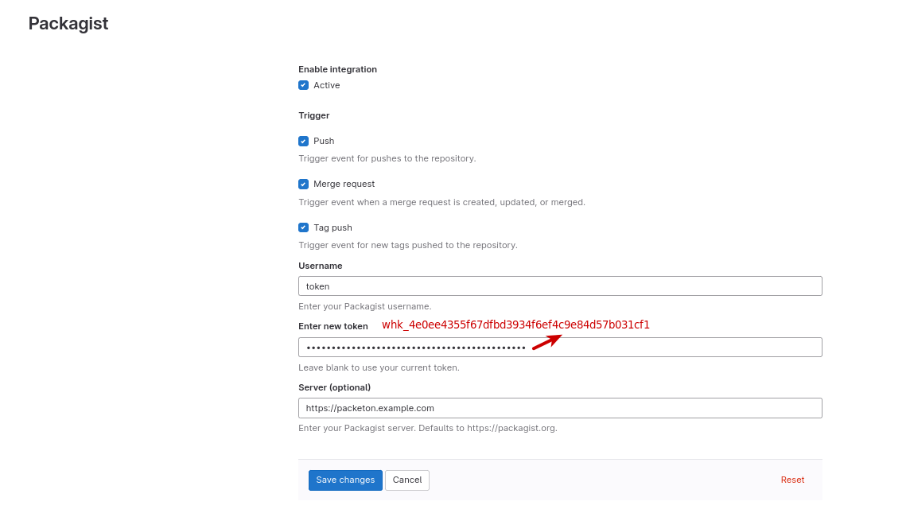

# OAuth2 and Sync integrations

Table of content
---------------
- [Pull Request review](pull-request-review.md)
- [GitHub Setup](oauth2/github-oauth.md)
- [GitHub App Setup](oauth2/githubapp.md)
- [GitLab Setup](oauth2/gitlab-integration.md)

## Base configuration

To enable OAuth2 integrations you need to add following configuration 
```yml
packeton:
    integrations:
        github: # Alias name 
            allow_login: true # default false 
            allow_register: true # default false 
            default_roles: ['ROLE_USER', 'ROLE_MAINTAINER', 'ROLE_GITLAB']
            login_title: Login or Register with GitHub
            clone_preference: 'api'
            repos_synchronization: true
            pull_request_review: true # Enable pull request composer.lock review. Default false 

#            webhook_url: 'https://packeton.google.dev/' - overwrite host when setup webhooks
            github:
                client_id: 'xxx'
                client_secret: 'xxx'

        gitlab2:  # Alias name - may be any url safe value.
            base_url: 'https://gitlab.production.com/'
            clone_preference: 'clone_https' # Allows [api, clone_https, clone_ssh]
            gitlab: # Provider name: github, gitlab, bitbucket etc 
                client_id: 'xxx'
                client_secret: 'xxx'
                api_version: 'v4' # you may overwrite only for gitlab provider, default v4

        # Use GitHub APP JWT
        # See https://docs.github.com/en/apps/creating-github-apps/authenticating-with-a-github-app/about-authentication-with-a-github-app
        githubapp_main:
            repos_synchronization: true
            pull_request_review: true
            githubapp:
                private_key: '%kernel.project_dir%/var/packeton-private-key.pem'
                passphrase: ~ # private key pass
                app_id: 345472

```

Where `clone_preference`:

- `api` - Use api to get composer info
- `clone_https` - clone repo with using oauth api token
- `clone_ssh` - clone repo with system ssh key

`repos_synchronization` - If enabled, a new package will be automatically created when you will push to a new or exists repo that contains `composer.json` 

## Supported 3-d provider

### GitHub

Scopes:

- login: `user:email`
- repositories: `read:org`, `repo`

Redirect Urls:

```
https://example.com/
```

### GitLab

Scopes:

- login: `read_user`
- repositories: `api`

Redirect Urls:

```
https://example.com/oauth2/{alias}/install
https://example.com/oauth2/{alias}/check
```

####  GitLab Groups Webhooks notices

A group webhooks needed for synchronization a new package. 
They are triggered by events that occur across all projects in the group.
This feature enabled only for Premium / EE / Gold paid plan, but it can be replaced with GitLab Packagist Integration

You must manually setup this integration.

[](img/gitlab.png)

Where token you can find on the packeton integration view page. The token must have `whk` prefix 
to find related integration access token.
